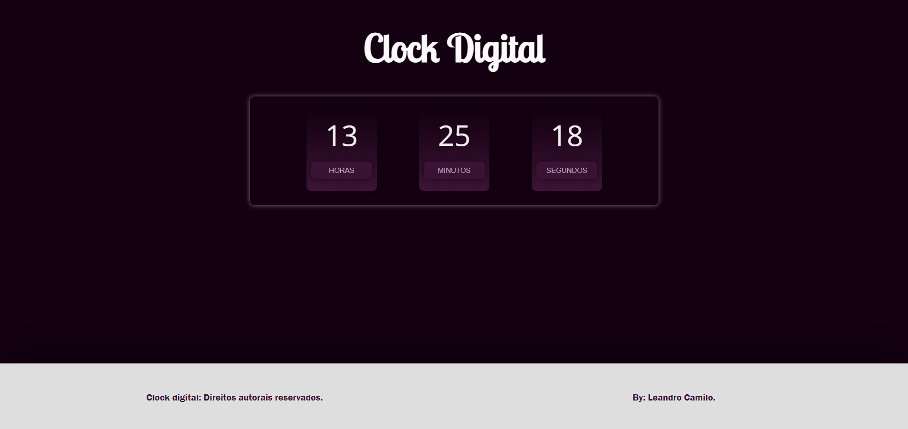
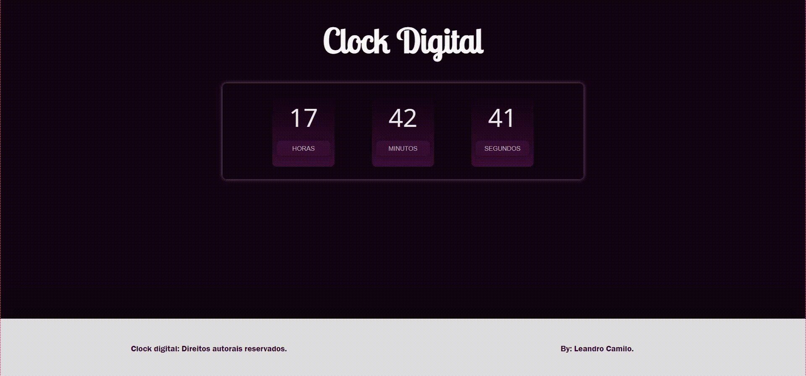
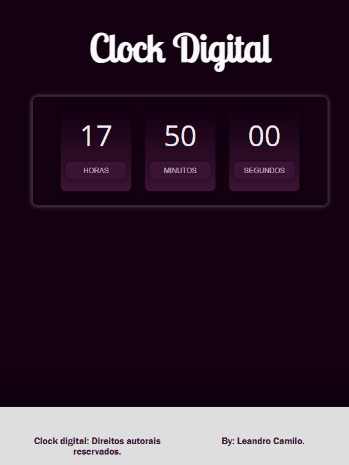

# Relógio Digital

### Abrir e rodar o projeto:

https://leandrocamilo09.github.io/Relogio_Digital/

## Objetivo:

Entender como obter informações globais da internet, no caso informação de horas, minutos e segundos apartir da linguagem JavaScript.

## Sobre o Projeto:

É uma proposta simples de uma plataforma web que mostra a atual hora, segundos e minutos.

## Dispositivos:

O projeto tem resposividade para qualquer tipo de tela. 

|            Tablete            |            Celular            |
| :---------------------------: | :---------------------------: |
|  |  |

## Equipe:

- `Leandro Camilo`

## Tecnologias utilizadas:

- `JavaScript`
- `HTML`
- `Css`
